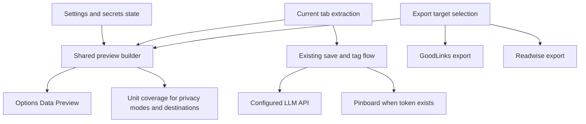

# feat: Add data flow and payload preview

## Summary

Add an Options-page Data Preview surface that explains what tldr stores, what it sends, and which destinations are active for the current settings. The plan keeps the one-click save behavior intact while making LLM, Pinboard, Readwise, and GoodLinks data flow visible enough for users, screenshots, and Chrome Web Store review.

---

## Problem Frame

tldr handles page-derived data and secrets: page title, URL, domain, readable text, tags, LLM API keys, and integration tokens. The extension currently performs the actual LLM payload construction inside the tagging call and attempts Pinboard sync after tagging when credentials exist, so a user cannot inspect the effective data boundary before using the feature.

The Chrome Web Store submission needs the same clarity. Chrome's privacy fields ask for extension purpose, permission reasons, user-data handling, and remote-code posture; the UI should make those claims easy to verify rather than relying on separate reviewer-only prose.

---

## Requirements

**Data-flow explanation**

- R1. The Options UI explains that tldr has no backend and that data leaves the browser only through user-configured LLM or integration flows.
- R2. The Options UI lists the main data classes tldr handles: page title, URL, domain, readable text or excerpt, tags, saved items, settings, API keys, Pinboard token, and Readwise token.
- R3. The Options UI distinguishes local storage, Chrome sync storage, and external destinations in user-facing language.
- R4. The Options UI states that API keys and integration tokens are not sent to the LLM payload.
- R5. The explanation covers title-only, title-plus-excerpt, and readable-text-truncated privacy modes.

**Current-tab payload preview**

- R6. The Options UI previews the current active tab's LLM-bound fields under the selected privacy mode.
- R7. The current-tab preview shows field presence and character counts by default, with actual excerpt text hidden until expanded.
- R8. The preview shows the configured LLM host when LLM tagging is configured.
- R9. The preview makes clear when no LLM endpoint is configured or when no content will be sent to an LLM.
- R10. The preview does not add a mandatory confirmation step to the normal save flow.

**Dynamic destinations**

- R11. The preview shows Pinboard as a possible save destination when the current settings make automatic Pinboard sync possible.
- R12. The preview shows Readwise when Readwise export is configured or selected for the export action.
- R13. The preview shows GoodLinks when GoodLinks export is selected for the export action.
- R14. Each shown destination lists the categories of data it would receive.
- R15. Disabled or unconfigured integrations are represented as not receiving data.

**Reviewer and listing support**

- R16. The Data Preview surface is screenshot-safe by default and does not expose secrets.
- R17. The UI distinguishes remote API calls from remotely hosted executable code.
- R18. The copy and data classes can be reused in privacy policy and Chrome Web Store disclosures.

---

## Key Technical Decisions

- **Shared preview builder:** Build preview data through shared pure helpers rather than hand-written UI copy so the preview and actual LLM/send behavior do not drift.
- **Existing Options surface:** Add the first version to the existing Options page and action bar rather than introducing an action popup.
- **No mandatory confirmation:** Keep preview inspection optional in v1 so the existing "Save & Tag Current Tab" flow remains lightweight.
- **Destination-aware, action-aware preview:** Model save-current-tab destinations separately from export-selected destinations because Pinboard sync happens during save while Readwise and GoodLinks are export flows.
- **Label current LLM defaults, do not change them here:** If a cloud LLM base URL is present by default or configuration, the preview must present it as the current configured destination; changing the default is deferred to a local-first onboarding plan.
- **Add lightweight unit coverage:** Add Vitest for pure TypeScript helper coverage because the repository currently has no test framework and this feature is privacy-sensitive.

---

## High-Level Technical Design

The preview builder should summarize the same categories used by the send flows: LLM receives title, URL, domain, known-tag context, and privacy-mode-limited excerpt; Pinboard receives URL, title, tags, shared/toread flags, and a short excerpt; Readwise receives URL, title, tags, and source; GoodLinks receives URL, title, and tags. Secrets should appear only as "configured" or "not configured" states.

---

## Implementation Units

### U1. Shared preview model and tests

- **Goal:** Create a pure preview model that describes privacy-mode payloads and destination data categories without touching Chrome APIs.
- **Requirements:** R2, R4, R5, R7, R14, R16
- **Dependencies:** None
- **Files:** `src/common/preview.ts`, `src/common/preview.test.ts`, `package.json`, `pnpm-lock.yaml`, `vitest.config.ts`
- **Approach:** Define user-facing preview structures for data classes, privacy modes, destination summaries, excerpt visibility, and safe secret states. Keep helper inputs plain enough that UI and background code can call them without DOM or Chrome runtime dependencies, and wire Vitest only for pure helper tests.
- **Patterns to follow:** Mirror existing `Settings`, `PrivacyMode`, and item shapes from `src/common/types.ts`; keep pure logic close to existing shared helpers like `src/background/tags.ts`.
- **Test scenarios:**
  - Covers AE1. Given title-only mode and extracted tab content, the preview omits excerpt content and reports that no page text is sent.
  - Covers AE2. Given title-plus-excerpt mode and text longer than the excerpt limit, the preview reports an excerpt character count and keeps raw excerpt text in an expandable field.
  - Given full-truncated mode and `maxChars`, the preview reports the truncated readable-text character count.
  - Given configured API-token references, the preview reports secrets as configured without exposing token values.
  - Given disabled integrations, destination summaries mark them as not receiving data.
- **Verification:** Unit tests exercise privacy modes, character counts, destination states, and secret redaction without requiring a browser runtime.

### U2. Background preview message for current tab

- **Goal:** Add a runtime message that returns a current-tab preview using the same extraction path as saving.
- **Requirements:** R6, R7, R8, R9, R10, R17
- **Dependencies:** U1
- **Files:** `src/background/index.ts`, `src/background/tabs.ts`, `src/background/llm.ts`, `src/background/pipeline.ts`
- **Approach:** Add a preview-only message path that queries the active tab, extracts readable content, loads settings and known tags, and returns a preview object without calling the LLM or any integration. Factor shared "privacy-mode excerpt selection" and "chat-completions URL display" logic so preview and send behavior use the same semantics.
- **Patterns to follow:** Follow the existing `chrome.runtime.onMessage` async response style in `src/background/index.ts` and the existing `extractFromActiveTab` active-tab extraction boundary in `src/background/tabs.ts`.
- **Test scenarios:**
  - Covers F2 / AE3. Given no usable LLM base URL, the message returns a no-destination state rather than failing as if a hidden provider exists.
  - Given a valid configured LLM base URL, the returned preview includes the normalized chat-completions destination without sending a network request.
  - Given a page where extraction fails or the tab is inaccessible, the response returns a user-facing error that does not mutate saved items.
  - Given title-only mode, the response does not include extracted page text in the preview payload.
- **Verification:** The preview message can be invoked from Options and returns preview data without creating an item, updating tags, calling the LLM, or syncing to Pinboard.

### U3. Options UI data-flow surface

- **Goal:** Add the fixed Data Preview explanation to Options in a way that is readable and screenshot-safe.
- **Requirements:** R1, R2, R3, R4, R5, R16, R17, R18
- **Dependencies:** U1
- **Files:** `static/options.html`, `static/options.css`, `src/ui/options.ts`
- **Approach:** Add a Data Preview area to the Options page that names storage locations, outbound destinations, privacy modes, and "does not send" statements. Use copy that can be reused in Chrome Web Store privacy fields and screenshots, while keeping exact wording centralized enough to avoid conflicting explanations.
- **Patterns to follow:** Use existing card, field, grid, status, and tab patterns in `static/options.html` and `static/options.css`; preserve the current tabbed Options structure.
- **Test scenarios:**
  - Covers F1. Opening Options shows local storage, sync storage, LLM transfer, and integration transfer categories.
  - Covers AE5. The default rendered Data Preview state does not reveal API keys, Pinboard token, Readwise token, or raw page excerpt text.
  - Changing privacy mode updates the explanatory mode summary before saving settings.
  - The copy distinguishes remote API calls from remote executable code.
- **Verification:** The Data Preview section is visible in Options, aligns with existing styling, and remains useful in a screenshot without private values.

### U4. Current-tab preview controls in Options

- **Goal:** Let users inspect the current tab's preview from Options without blocking normal save behavior.
- **Requirements:** R6, R7, R8, R9, R10, R16
- **Dependencies:** U1, U2, U3
- **Files:** `static/options.html`, `static/options.css`, `src/ui/options.ts`
- **Approach:** Add a preview action near the existing "Save & Tag Current Tab" action and render the response from the background preview message. Show field names and counts by default, with a controlled expansion affordance for actual excerpt content.
- **Patterns to follow:** Follow existing `saveCurrent` permission checks, `runtimeStatus` feedback, and action-bar patterns in `src/ui/options.ts`.
- **Test scenarios:**
  - Covers F2 / AE1. In title-only mode, previewing the current tab shows no excerpt content.
  - Covers F2 / AE2. In excerpt mode, previewing the current tab shows character count by default and reveals text only after expansion.
  - Covers AE3. With no configured LLM destination, the preview explains that no LLM endpoint is configured.
  - Permission denial for the current tab leaves the preview empty and shows an actionable status message.
  - Running preview does not trigger `save-current-tab` or change the save button's existing behavior.
- **Verification:** Users can preview the active tab from Options, inspect or hide excerpt text, and still save normally.

### U5. Dynamic destination rendering for save and export flows

- **Goal:** Show which external destinations are active for save and export actions and what data categories each would receive.
- **Requirements:** R11, R12, R13, R14, R15
- **Dependencies:** U1, U3, U4
- **Files:** `src/ui/options.ts`, `static/options.html`, `static/options.css`, `src/background/pipeline.ts`, `src/background/exporters.ts`
- **Approach:** Represent LLM, Pinboard, Readwise, and GoodLinks destinations from current settings and selected export targets. Treat Pinboard as save-related when a token is configured because `tagAndMaybeSync` currently attempts Pinboard sync, while Readwise and GoodLinks remain export-selected destinations.
- **Patterns to follow:** Follow existing `target_goodlinks` and `target_readwise` checkbox behavior and the current Pinboard token reference convention.
- **Test scenarios:**
  - Covers F3 / AE4. When Readwise is unconfigured and unchecked, the destination list says Readwise will not receive data.
  - When GoodLinks export is checked, the destination list shows URL, title, and tags as outgoing categories.
  - When a Pinboard token is configured, the save preview shows Pinboard as a possible recipient with URL, title, tags, and short excerpt categories.
  - When no integration tokens or export targets are active, the preview states that no integration destination will receive data.
- **Verification:** Destination summaries update when settings load, tokens are saved or cleared, and export target checkboxes change.

### U6. Build, review, and store-screenshot readiness

- **Goal:** Verify the feature, preserve the release boundary, and prepare the Data Preview for Chrome Web Store evidence.
- **Requirements:** R16, R17, R18
- **Dependencies:** U1, U2, U3, U4, U5
- **Files:** `README.md`, `package.json`, `scripts/build.mjs`, `scripts/package.mjs`
- **Approach:** Add concise documentation that points to the Data Preview as the source of truth for privacy-copy drafting. Validate that build/package flow still excludes source maps and that the Vitest script from U1 fits the existing release ritual without turning this feature into a full release-preflight project.
- **Patterns to follow:** Keep README updates aligned with its existing "Packaging & Release Ritual" section and avoid moving broader roadmap claims into this feature.
- **Test scenarios:**
  - Build output still includes `options.html`, `options.css`, bundled UI script, background worker, manifest, icons, and readability asset.
  - Package output still has `manifest.json` at the ZIP root and excludes source maps.
  - A screenshot-safe Options state can be produced without private tokens or raw page content visible by default.
- **Verification:** The project has a repeatable verification path for helper tests, extension build, and screenshot-safe review of the Options page.

---

## Scope Boundaries

### Deferred to Follow-Up Work

- Add an action popup with Save, Preview, and Settings.
- Build full per-item provenance history.
- Build a local diagnostic flight recorder for save and sync failures.
- Add a full sync-state model with queued, retrying, failed, and synced statuses.
- Revisit the default cloud LLM endpoint as part of a local-first onboarding plan.

### Outside This Product Change

- Scheduled reports, idea lab, digests, or broader thinking-partner roadmap work.
- Any tldr-hosted backend, remote telemetry service, or analytics collection.
- Final Chrome Web Store listing copy; this feature supplies product-visible truth for that copy.

---

## Risks and Dependencies

- **Preview/send drift:** If the preview duplicates payload logic instead of sharing helper semantics, it can become false privacy documentation.
- **Pinboard ambiguity:** Current save behavior silently attempts Pinboard sync when a token exists; the plan treats that as a possible save destination until a separate product decision changes sync behavior.
- **Browser-only APIs in tests:** Pure preview helpers must stay separate from Chrome runtime APIs so unit tests can run without a browser.
- **Build blocker:** Local `pnpm build` is currently blocked by pnpm's `esbuild` build-script approval policy; implementation should resolve or document that before relying on build verification.
- **Official policy dependence:** Chrome Web Store privacy requirements can change, so final submission copy should be checked against official docs during release.

---

## Sources and Research

- Origin requirements: `docs/brainstorms/2026-06-12-data-flow-payload-preview-requirements.md`
- Ideation source: `docs/ideation/2026-06-12-chrome-web-store-launch-readiness-ideation.md`
- Local code references: `src/ui/options.ts`, `static/options.html`, `static/options.css`, `src/background/index.ts`, `src/background/tabs.ts`, `src/background/pipeline.ts`, `src/background/llm.ts`, `src/background/exporters.ts`, `src/common/storage.ts`, `src/common/types.ts`, `static/manifest.json`
- Chrome Web Store privacy fields: https://developer.chrome.com/docs/webstore/cws-dashboard-privacy
- Chrome Web Store user data FAQ: https://developer.chrome.com/docs/webstore/program-policies/user-data-faq
- Chrome Web Store prepare ZIP guidance: https://developer.chrome.com/docs/webstore/prepare
- Chrome Web Store listing guidance: https://developer.chrome.com/docs/webstore/cws-dashboard-listing
- Chrome Web Store test instructions: https://developer.chrome.com/docs/webstore/cws-dashboard-test-instructions
